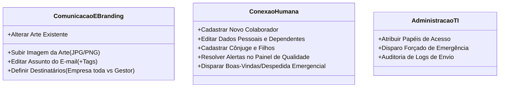

# 📘 Guia Definitivo do Módulo de Comunicados — TechControl

Este documento detalha o funcionamento completo do módulo de Comunicados Automáticos do sistema **TechControl**, abrangendo a **Arquitetura Técnica**, o **Modelo de Negócio e Gestão Humana**, e um **Manual Passo a Passo para Usuários Operacionais**.

---

# 📑 Sumário
1. [Visão Geral & Filosofia do Módulo](#1-visão-geral--filosofia-do-módulo)
2. [Parte Técnica (Arquitetura & Engenharia)](#2-parte-técnica-arquitetura--engenharia)
   - [2.1. Estrutura do Banco de Dados (Supabase)](#21-estrutura-do-banco-de-dados-supabase)
   - [2.2. Autenticação, Papéis e RLS](#22-autenticação-papéis-e-rls)
   - [2.3. Automação Diária e Ciclo de Vida (Cron & APIs)](#23-automação-diária-e-ciclo-de-vida-cron--apis)
   - [2.4. Componentes Frontend & Estado Compartilhado](#24-componentes-frontend--estado-compartilhado)
3. [Parte Humana & Regras de Negócio](#3-parte-humana--regras-de-negócio)
   - [3.1. Os 4 Eventos Automáticos Oficiais](#31-os-4-eventos-automáticos-oficiais)
   - [3.2. Regra da Inclusão Universal](#32-regra-da-inclusão-universal)
   - [3.3. Divisão de Responsabilidades (Fronteiras de Trabalho)](#33-divisão-de-responsabilidades-fronteiras-de-trabalho)
4. [Tutorial Ilustrado para Usuários Leigos](#4-tutorial-ilustrado-para-usuários-leigos)
   - [4.1. Manual da Comunicação & Branding (Artes & Assuntos)](#41-manual-da-comunicação--branding-artes--assuntos)
   - [4.2. Manual da Conexão Humana (DP, RH e DHO)](#42-manual-da-conexão-humana-dp-rh-e-dho)
   - [4.3. Perguntas Frequentes (FAQ & Dúvidas Operacionais)](#43-perguntas-frequentes-faq--dúvidas-operacionais)

---

# 1. Visão Geral & Filosofia do Módulo

O módulo de Comunicados do **TechControl** foi desenhado com um objetivo principal: **eliminar o trabalho manual repetitivo e burocrático** no envio de homenagens e felicitações corporativas da Interlub, garantindo que nenhum colaborador seja esquecido.

### Por que o sistema foi simplificado?
Anteriormente, o sistema expunha controles técnicos complexos, mais de 5 checkboxes granulares de permissão e cadastros duplicados. A nova versão consolida o fluxo em duas frentes com papéis claros:
- **🎨 Comunicação e Branding:** Foca exclusivamente na qualidade visual das artes e na personalização dos títulos e destinatários.
- **👥 Conexão Humana (DP / RH / DHO):** Foca na completude cadastral dos colaboradores e suas famílias, com auditoria em tempo real.

```mermaid
graph TD
    subgraph Conexão Humana
        A[DP / RH / DHO] -->|Cadastra Colaborador + Família| B[(Banco de Dados Supabase)]
        A -->|Corrige Alertas Cadastrais| B
    end

    subgraph Comunicação & Branding
        C[Branding] -->|Envia Arte Visual PNG/JPG| D[(Armazenamento Storage)]
        C -->|Configura Modelos de Assunto| B
    end

    subgraph Robô TechControl (Cron Diário)
        B -->|Lê aniversários do dia| E[Disparador Automático 08:00]
        D -->|Anexa a arte cadastrada| E
        E -->|Dispara e-mail via Resend| F[📬 Caixa de Entrada dos Colaboradores]
    end
```

---

# 2. Parte Técnica (Arquitetura & Engenharia)

## 2.1. Estrutura do Banco de Dados (Supabase)

O ecossistema de comunicados apoia-se em 4 tabelas relacionais no PostgreSQL do Supabase:

### A. Tabela `colaboradores` (Principais colunas do módulo)
| Coluna | Tipo | Descrição |
| :--- | :--- | :--- |
| `id` | UUID / Text | Identificador primário único do colaborador. |
| `nome_completo` | Text | Nome do colaborador utilizado nas tags `{nome}`. |
| `email` | Text | E-mail corporativo principal. |
| `data_nascimento` | Date (`YYYY-MM-DD`) | Base de cálculo do aniversário de colaborador. |
| `data_admissao` | Date (`YYYY-MM-DD`) | Base de cálculo do tempo de empresa. |
| `conjuge_nome` | Text | Nome do cônjuge (tag `{nome_conjuge}`). |
| `conjuge_data_nascimento` | Date (`YYYY-MM-DD`) | Data de aniversário do cônjuge. |
| `conjuge_email` | Text | E-mail do cônjuge (para envio direto se configurado). |
| `filhos` | JSONB `[{nome, data_nascimento, parentesco}]` | Lista de filhos para cálculo do 1º aninho. |
| `incluir_comunicados` | Boolean (Default: `true`) | Flag global de participação nos comunicados. |
| `eh_comunicacao_branding` | Boolean (Default: `false`) | Permissão de acesso ao painel de artes e modelos. |
| `eh_conexao_humana` | Boolean (Default: `false`) | Permissão de cadastro total e auditoria cadastral. |
| `gestor_imediato` | Text | Nome ou e-mail do gestor para cópia de comunicado. |

### B. Tabela `comunicados_artes`
Armazena a fila mensal de eventos que necessitam de arte gráfica:
- `id`: Identificador da demanda de arte.
- `tipo_comunicado`: `aniversario_colaborador` | `aniversario_conjuge` | `aniversario_filho_1ano` | `tempo_empresa`.
- `colaborador_id`: Chave estrangeira do colaborador.
- `colaborador_nome`: Nome do colaborador.
- `data_evento`: Data exata em que o evento ocorrerá no ano corrente (`YYYY-MM-DD`).
- `descricao_evento`: Ex: *"Aniversário de 32 anos"*, *"5 anos de empresa"*, *"1 aninho da Maria"*.
- `imagem_url`: URL pública da imagem salva no Supabase Storage.
- `status_arte`: `sem_arte` | `arte_carregada`.
- `mes_referencia`: Mês da competência (`YYYY-MM`).

### C. Tabela `comunicados_config`
Configurações globais dos 4 tipos de comunicados:
- `tipo_comunicado`: Código do tipo.
- `assunto_template`: String com variáveis dinâmicas (ex: `🎉 Parabéns pelo seu dia, {nome}!`).
- `destinatarios_tipo`: `todos_colaboradores` | `colaborador_conjuge_gestor` | `colaborador_e_gestor`.
- `ativo`: Boolean para ativar/pausar o tipo globalmente.

### D. Tabela `comunicados_log`
Auditoria imutável de todos os envios realizados:
- `tipo_comunicado`, `colaborador_nome`, `destinatarios` (array de e-mails), `data_envio`, `status` (`sucesso` | `erro`), `detalhes_erro`.

---

## 2.2. Autenticação, Papéis e RLS

A segurança do portal e das operações foi simplificada com retrocompatibilidade:
- **Autenticação Segura:** O endpoint `POST /api/portal-auth` valida as credenciais com verificação de senha em tempo constante (`constant-time`) via Service Role, sem expor hashes de senha ao navegador.
- **Sessão do Usuário:** O hook `usePortalColaborador.jsx` e `sessionStorage` armazenam `eh_comunicacao_branding` e `eh_conexao_humana`.
- **Validação Dupla:** As páginas aceitam tanto as flags booleanas novas quanto o array `permissoes_comunicados` (`['comunicacao_branding']`, `['conexao_humana']`) ou a área nominal (`area === "Comunicação e Branding"`).

---

## 2.3. Automação Diária e Ciclo de Vida (Cron & APIs)

A execução das rotinas de e-mail é 100% automatizada e roda em ambiente serverless na Vercel:

```
[Cron Diário: 08:00 AM] 
       │
       ▼
[api/cronDiario.js] ── (1. Executa gerarDemandasComunicados: garante demandas dos próximos 30 dias)
       │
       ▼
(2. Executa dispararComunicados: busca eventos onde data_evento == HOJE)
       │
       ├─► Verifica se comunicados_config.ativo == true
       ├─► Monta o assunto substituindo as tags: {nome}, {area}, {anos}, {nome_conjuge}, {nome_filho}
       ├─► Obtém a lista de destinatários configurada
       ├─► Monta o corpo HTML com a arte da imagem (imagem_url)
       ├─► Envia via Resend API
       └─► Registra o log em comunicados_log
```

---

# 3. Parte Humana & Regras de Negócio

## 3.1. Os 4 Eventos Automáticos Oficiais

Por definição estratégica, o módulo atende **apenas e exclusivamente aos seguintes 4 eventos**:

1. 🎂 **Aniversário do Colaborador:** Celebrado no dia de nascimento do colaborador.
2. 💑 **Aniversário do Cônjuge:** Celebrado na data de aniversário do cônjuge registrado.
3. 🎈 **1 Aninho do Filho(a):** Celebrado exclusivamente na data em que a criança completa exatamente 1 ano de vida.
4. 🏆 **Tempo de Empresa:** Celebrado anualmente na data de admissão do colaborador (1 ano, 2 anos, 5 anos, 10 anos, etc.).

> [!NOTE]
> E-mails de **Boas-Vindas** (novas admissões) e **Despedida** (desligamentos) possuem canais próprios de integração, mas a Conexão Humana possui um botão de contingência caso necessite disparar um comunicado manual de emergência.

---

## 3.2. Regra da Inclusão Universal

- **Sem Opt-in Manual:** Todos os colaboradores cadastrados e com status ativo participam automaticamente de todos os comunicados sempre que as respectivas datas estiverem preenchidas.
- **Transparência Total:** Caso algum colaborador não tenha cônjuge ou filhos cadastrados, o sistema simplesmente não gerará demandas para esses tipos específicos, mantendo a rotina 100% livre de erros.

---

## 3.3. Divisão de Responsabilidades (Fronteiras de Trabalho)



---

# 4. Tutorial Ilustrado para Usuários Leigos

---

## 4.1. Manual da Comunicação & Branding (Artes & Assuntos)

### 🎨 Como acessar a Central de Comunicados
1. Faça login no **Portal do Colaborador** (`/portal-login`).
2. No menu lateral ou no card de atalhos, clique em **Central de Comunicados**.
3. Você verá a tela dividida em 3 abas simples:
   - 🔴 **Precisa de Arte:** Lista todas as homenagens dos próximos 30 dias que ainda não têm imagem.
   - 🟢 **Este Mês / Prontos:** Lista tudo o que já está com a arte pronta, aguardando o dia do envio.
   - 📬 **Enviados:** Histórico de todos os comunicados já disparados pelo robô.

---

### 🖼️ Como subir ou trocar uma arte
1. Na aba **Precisa de Arte**, localize o card da pessoa homenageada.
2. Note a etiqueta de urgência no topo do card:
   - 🚨 **Vermelha (Urgente):** O aniversário é hoje ou nos próximos 3 dias!
   - 🟡 **Amarela (Atenção):** O aniversário ocorre em até 10 dias.
   - ⚪ **Cinza:** O aniversário ocorre em mais de 10 dias.
3. Clique no botão azul **"Fazer Upload da Arte"** (ou arraste a imagem sobre o card).
4. Escolha o arquivo da sua máquina (formato **PNG** ou **JPG** de alta qualidade).
5. Pronto! O card se moverá automaticamente para a aba **"Este Mês / Prontos"**.

> [!TIP]
> Para ver como a arte ficou, basta clicar sobre a miniatura da foto no card para abrir o zoom em alta resolução. Se precisar trocar, basta clicar no ícone de lixeira e enviar uma nova.

---

### ✉️ Como mudar o Assunto do E-mail e os Destinatários
1. No cabeçalho da página de Comunicados, clique no botão roxo **"Modelos & Destinatários"**.
2. Na janela que se abrir, você verá os 4 tipos de comunicado.
3. **Para alterar o Assunto:**
   - Edite o campo de texto.
   - Clique nos botõezinhos de tag roxos (ex: `+{nome}`, `+{anos}`, `+{area}`) para inserir o nome ou tempo de empresa automaticamente no título.
   - Exemplo: `Parabéns pelos seus {anos} anos de dedicação na Interlub, {nome}!`
4. **Para alterar quem recebe:**
   - Selecione a opção desejada no seletor:
     - 📢 *Toda a empresa (Todos os colaboradores ativos)*
     - 💑 *Colaborador + Cônjuge + Gestor direto*
     - 👤 *Apenas Colaborador + Gestor direto*
5. As alterações são salvas na hora!

---

## 4.2. Manual da Conexão Humana (DP, RH e DHO)

### 👥 Como cadastrar ou editar um Colaborador
1. Acesse o **Portal do Colaborador** e clique em **Gestão de Colaboradores**.
2. Clique no botão verde **"+ Novo Colaborador"** (ou clique no ícone de lápis para editar um colaborador existente).
3. O formulário agora é dividido em 3 etapas muito fáceis:
   - **Aba 1: Profissional:** Preencha Nome, E-mail Corporativo, Cargo, Área, Data de Admissão e Unidade.
   - **Aba 2: Pessoal & Gestão:** Preencha Data de Nascimento do Colaborador, Telefone/WhatsApp, CPF e selecione o **Gestor Direto**.
   - **Aba 3: Família & Dependentes:**
     - Preencha o nome do cônjuge, data de nascimento e e-mail.
     - Clique em **"+ Adicionar Filho(a)"** e insira o nome e a data de nascimento da criança.
4. Clique em **"Salvar Alterações"**.

---

### 🚨 Como usar a Auditoria de Qualidade Cadastral
Para evitar que aniversários passem em branco por falta de preenchimento, o sistema possui um alerta automático:

1. Na tela de **Gestão de Colaboradores**, repare no card superior **"Qualidade Cadastral para Comunicados"**.
2. Se houver alguma pendência, o card listará os colaboradores com alertas visuais:
   - 🔴 *Colaborador sem Data de Nascimento*
   - 🔴 *Cônjuge cadastrado sem Data de Nascimento*
   - 🔴 *Filho(a) cadastrado sem Data de Nascimento*
   - 🔴 *Data de Admissão não informada*
   - 🟡 *Sem e-mail cadastrado ou sem Gestor vinculado*
3. Basta clicar no botão **"Completar Cadastro"** ao lado do nome da pessoa para abrir o formulário diretamente no ponto que precisa de ajuste.

---

### 🛡️ Envio de Contingência (Boas-Vindas ou Despedida)
Caso precise enviar um e-mail de admissão ou desligamento fora do fluxo padrão:
1. Na tela de Gestão de Colaboradores, clique no botão **"Contingência de Envios"**.
2. Selecione o Colaborador.
3. Escolha o tipo (`Boas-Vindas` ou `Despedida`).
4. Clique em **"Disparar Comunicado Manual"**.

---

## 4.3. Perguntas Frequentes (FAQ & Dúvidas Operacionais)

#### Q1: Se a Comunicação não subir a arte a tempo, o que acontece no dia do aniversário?
> **R:** O robô do sistema só enviará o comunicado se a arte estiver cadastrada (`arte_carregada`). Por isso, os cards de eventos dos próximos 3 dias pulsam em vermelho para avisar a equipe de Branding.

#### Q2: O filho do colaborador tem 3 anos. O sistema vai mandar e-mail?
> **R:** Não. Conforme a regra de negócio oficial da Interlub, o comunicado de filho ocorre **exclusivamente no aniversário de 1 aninho**. O sistema calcula a idade e só gera demanda no primeiro ano.

#### Q3: Um colaborador foi admitido hoje. Preciso marcar algum checkbox para ele receber aniversários?
> **R:** Não! A inclusão é 100% automática. Basta cadastrar a data de nascimento e a data de admissão dele na ficha cadastral.

#### Q4: O que acontece quando um colaborador é marcado como "Desligado"?
> **R:** Automaticamente o sistema cancela todas as demandas de arte futuras dele e interrompe qualquer disparo de e-mail programado.

---

*Documento homologado e integrado à versão estável do TechControl.*